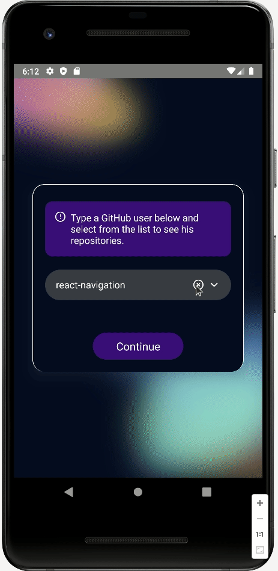
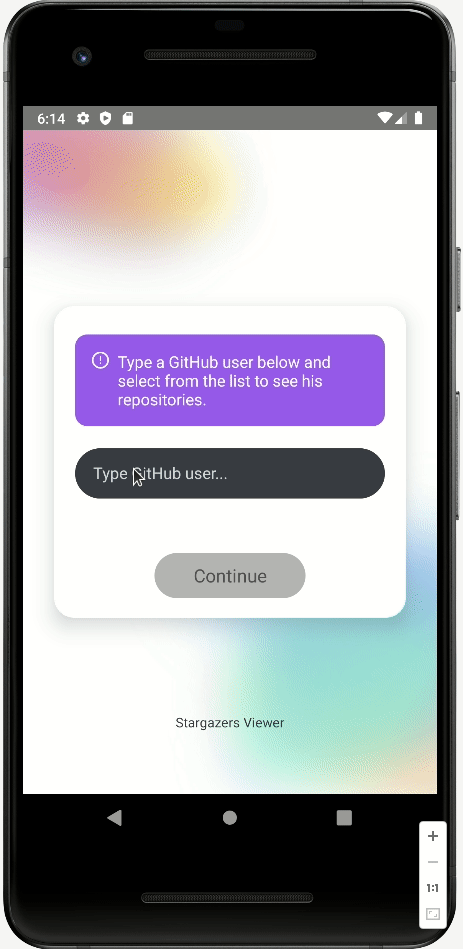

# React Native Stargazers Viewer 
 

<table style="margin-left:auto;margin-right:auto;">
 <tr>
    <td>
Dark preview
</td>
    <td>
Light preview
</td>
 </tr>
 <tr>
    <td>
        <!--  -->
        
    </td>
    <td>
        <!--  -->
        
    </td>
 </tr>
</table>
